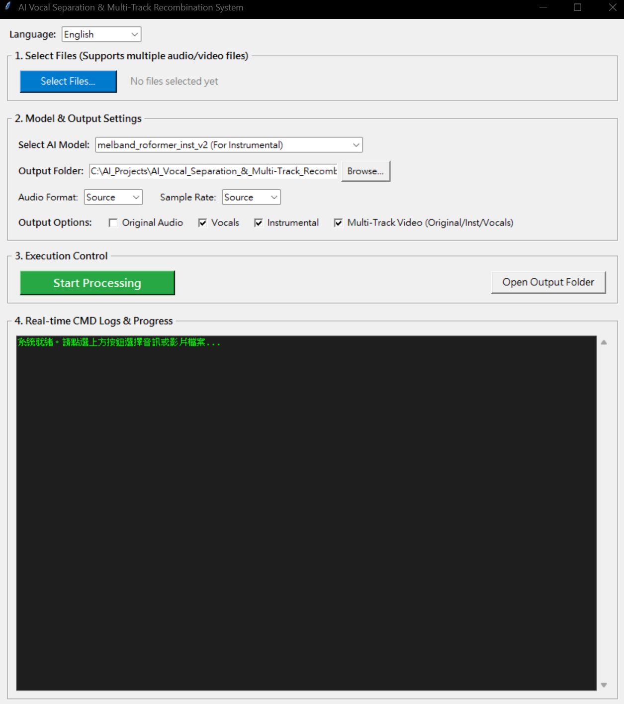

# AI Vocal Separation & Multi-Track Recombination System
# AI 人聲分離與多軌重組系統 / AI 人声分离与多轨重组系统 / AI ボーカル分離・マルチトラック再構築システム / AI 보컬 분리 및 멀티트랙 재조합 시스템

[繁體中文](#繁體中文) | [简体中文](#简体中文) | [English](#english) | [日本語](#日本語) | [한국어](#한국어)

---

## 繁體中文

### 專案介紹
這是一個基於 Python 與 Tkinter 開發的 **AI 人聲分離與多軌影音重組系統**。利用先進的 Roformer 模型（`audio-separator`），能夠極速且高精準度地將音訊或影片中的人聲與伴奏分離，並支援將分離後的軌道重新組合成包含多音軌的 MKV 影片。

### 模型準備 (重要)
使用前請在專案根目錄下建立一個名為 **`models`** 的資料夾，並將以下模型檔案與其對應的 `.yaml` 設定檔放入其中：
- `melband_roformer_inst_v2.ckpt` / `config_melbandroformer_inst_v2.yaml` (伴奏分離專用)
- `model_bs_roformer_ep_317_sdr_12.9755.ckpt` / `model_bs_roformer_ep_317_sdr_12.9755.yaml` (人聲分離專用)
> **模型下載連結**：
> https://huggingface.co/pcunwa/Mel-Band-Roformer-Inst/tree/main
> https://huggingface.co/Eddycrack864/Music-Source-Separation-Training/tree/main

### 主要功能
- **高效 AI 模型**：內建 `melband_roformer_inst_v2` 與 `model_bs_roformer_ep_317_sdr_12.9755`。
- **支援多格式**：支援 MP3, WAV, FLAC, M4A 及主流影片格式 (MP4, MKV, AVI, MOV, WEBM)。
- **多軌影音重組**：自動將原音、伴奏與人聲封裝至單一 MKV 檔案，完美支援多音軌切換。
- **多國語言介面**：支援繁體中文、簡體中文、英文、日文與韓文即時切換。
- **即時日誌回報**：內建終端機輸出攔截與進度顯示，清楚掌握執行進度。

### 快速安裝與執行
1. 確保已安裝 **Python 3.8+**（安裝時請務必勾選 "Add Python to PATH"）。
2. 下載本專案所有檔案至同一個資料夾。
3. **一鍵啟動**：直接雙擊 **`launch.bat`**。
   - 首次執行時，系統會自動建立虛擬環境 `venv` 並透過 `requirements.txt` 安裝所有必要套件，完成後將自動啟動程式。

---

## 简体中文

### 项目介绍
这是一个基于 Python 与 Tkinter 开发的 **AI 人声分离与多轨影音重组系统**。利用先进的 Roformer 模型（`audio-separator`），能够极速且高精准度地将音频或视频中的人声与伴奏分离，并支持将分离后的轨道重新组合成包含多音轨的 MKV 视频。

### 模型准备 (重要)
使用前请在项目根目录下创建一个名为 **`models`** 的文件夹，并将以下模型文件与其对应的 `.yaml` 配置文件放入其中：
- `melband_roformer_inst_v2.ckpt` / `config_melbandroformer_inst_v2.yaml` (伴奏分离专用)
- `model_bs_roformer_ep_317_sdr_12.9755.ckpt` / `model_bs_roformer_ep_317_sdr_12.9755.yaml` (人声分离专用)
> **模型下载链接**：
> https://huggingface.co/pcunwa/Mel-Band-Roformer-Inst/tree/main
> https://huggingface.co/Eddycrack864/Music-Source-Separation-Training/tree/main

### 主要功能
- **高效 AI 模型**：内置 `melband_roformer_inst_v2` 与 `model_bs_roformer_ep_317_sdr_12.9755`。
- **支持多格式**：支持 MP3, WAV, FLAC, M4A 及主流视频格式 (MP4, MKV, AVI, MOV, WEBM)。
- **多轨影音重组**：自动将原音、伴奏与人声封装至单一 MKV 文件，完美支持多音轨切换。
- **多语言界面**：支持繁体中文、简体中文、英文、日文与韩文实时切换。
- **实时日志回报**：内置终端机输出拦截与进度显示，清楚掌握执行进度。

### 快速安装与执行
1. 确保已安装 **Python 3.8+**（安装时请务必勾选 "Add Python to PATH"）。
2. 下载本项目所有文件至同一个文件夹。
3. **一键启动**：直接双击 **`launch.bat`**。
   - 首次运行时，系统会自动创建虚拟环境 `venv` 并通过 `requirements.txt` 安装所有必要插件，完成后将自动启动程序。

---

## English

### Project Introduction
This is an **AI Vocal Separation & Multi-Track Audio/Video Recombination System** developed based on Python and Tkinter. Utilizing the advanced Roformer model (`audio-separator`), it can separate vocals and accompaniment from audio or video with extreme speed and high precision, and supports recombining the separated tracks into an MKV video containing multiple audio tracks.

### Model Preparation (Important)
Before use, please create a folder named **`models`** in the project root directory, and place the following model files along with their corresponding `.yaml` configuration files into it:
- `melband_roformer_inst_v2.ckpt` / `config_melbandroformer_inst_v2.yaml` (For accompaniment separation)
- `model_bs_roformer_ep_317_sdr_12.9755.ckpt` / `model_bs_roformer_ep_317_sdr_12.9755.yaml` (For vocal separation)
> **Model Links**:
> https://huggingface.co/pcunwa/Mel-Band-Roformer-Inst/tree/main
> https://huggingface.co/Eddycrack864/Music-Source-Separation-Training/tree/main

### Key Features
- **High-Efficiency AI Models**: Built-in `melband_roformer_inst_v2` and `model_bs_roformer_ep_317_sdr_12.9755`.
- **Multi-Format Support**: Supports MP3, WAV, FLAC, M4A, and mainstream video formats (MP4, MKV, AVI, MOV, WEBM).
- **Multi-Track Audio/Video Recombination**: Automatically encapsulates original audio, accompaniment, and vocals into a single MKV file, perfectly supporting multi-track switching.
- **Multi-Language Interface**: Supports real-time switching between Traditional Chinese, Simplified Chinese, English, Japanese, and Korean.
- **Real-Time Log Reporting**: Built-in terminal output interception and progress display for clear tracking of execution progress.

### Quick Start & Installation
1. Ensure **Python 3.8+** is installed (make sure to check "Add Python to PATH" during installation).
2. Download all project files into the same folder.
3. **One-Click Launch**: Simply double-click **`launch.bat`**.
   - On the first run, the system will automatically create a `venv` virtual environment and install all required packages via `requirements.txt`, then start the application.

---

## 日本語

### プロジェクト紹介
これは Python と Tkinter をベースに開発された **AI ボーカル分離・マルチトラック映像再構築システム** です。高度な Roformer モデル（`audio-separator`）を利用して、音声や動画内のボーカルと伴奏を極めて高速かつ高精度に分離し、分離されたトラックをマルチオーディオトラックを含む MKV 動画に再構築することをサポートします。

### モデルの準備（重要）
使用する前に、プロジェクトのルートディレクトリに **`models`** という名前のフォルダを作成し、以下のモデルファイルとそれに対応する `.yaml` 設定ファイルを配置してください：
- `melband_roformer_inst_v2.ckpt` / `config_melbandroformer_inst_v2.yaml`（伴奏分離専用）
- `model_bs_roformer_ep_317_sdr_12.9755.ckpt` / `model_bs_roformer_ep_317_sdr_12.9755.yaml`（ボーカル分離専用）
> **モデルダウンロードリンク**:
> https://huggingface.co/pcunwa/Mel-Band-Roformer-Inst/tree/main
> https://huggingface.co/Eddycrack864/Music-Source-Separation-Training/tree/main

### 主な機能
- **高効率 AI モデル**: `melband_roformer_inst_v2` と `model_bs_roformer_ep_317_sdr_12.9755` を内蔵。
- **マルチフォーマット対応**: MP3、WAV、FLAC、M4A および主要な動画形式（MP4、MKV、AVI、MOV、WEBM）をサポート。
- **マルチトラック映像再構築**: 原音、伴奏、ボーカルを単一の MKV ファイルに自動でカプセル化し、マルチオーディオトラックの切り替えを完璧にサポート。
- **多言語インターフェース**: 繁体字中国語、簡体字中国語、英語、日本語、韓国語のリアルタイム切り替えをサポート。
- **リアルタイムログ出力**: 内蔵されたターミナル出力インターセプトと進捗表示により、実行進度を明確に把握可能。

### クイックスタートとインストール
1. **Python 3.8+** がインストールされていることを確認します（インストール時に「Add Python to PATH」にチェックを入れてください）。
2. プロジェクトのすべてのファイルを同じフォルダにダウンロードします。
3. **ワンクリック起動**：**`launch.bat`** をダブルクリックします。
   - 初回実行時に、システムが自動的に仮想環境 `venv` を作成し、`requirements.txt` を通じて必要なパッケージをすべてインストールして起動します。

---

## 한국어

### 프로젝트 소개
Python과 Tkinter를 기반으로 개발된 **AI 보컬 분리 및 멀티트랙 오디오/비디오 재조합 시스템**입니다. 고급 Roformer 모델(`audio-separator`)을 활용하여 오디오 또는 비디오 내의 보컬과 반주를 극도로 빠르고 높은 정확도로 분리할 수 있으며, 분리된 트랙을 여러 오디오 트랙이 포함된 MKV 비디오로 재조합하는 기능을 지원합니다.

### 모델 준비 (중요)
사용하기 전에 프로젝트 루트 디렉토리에 **`models`**라는 이름의 폴더를 만들고, 다음 모델 파일과 해당 `.yaml` 설정 파일을 그 안에 넣어주세요:
- `melband_roformer_inst_v2.ckpt` / `config_melbandroformer_inst_v2.yaml` (반주 분리 전용)
- `model_bs_roformer_ep_317_sdr_12.9755.ckpt` / `model_bs_roformer_ep_317_sdr_12.9755.yaml` (보컬 분리 전용)
> **모델 다운로드 링크**:
> https://huggingface.co/pcunwa/Mel-Band-Roformer-Inst/tree/main
> https://huggingface.co/Eddycrack864/Music-Source-Separation-Training/tree/main

### 주요 기능
- **고효율 AI 모델**: `melband_roformer_inst_v2` 및 `model_bs_roformer_ep_317_sdr_12.9755` 내장.
- **다양한 포맷 지원**: MP3, WAV, FLAC, M4A 및 주요 동영상 형식(MP4, MKV, AVI, MOV, WEBM) 지원.
- **멀티트랙 오디오/비디오 재조합**: 원음, 반주, 보컬을 단일 MKV 파일로 자동 패키징하여 멀티 오디오 트랙 전환을 완벽하게 지원.
- **다국어 인터페이스**: 번체 중국어, 간체 중국어, 영어, 일본어, 한국어 실시간 전환 지원.
- **실시간 로그 보고**: 내장된 터미널 출력 인터셉트 및 진행률 표시를 통해 실행 진행 상황을 명확하게 파악.

### 빠른 시작 및 설치
1. **Python 3.8+**가 설치되어 있는지 확인합니다(설치 시 "Add Python to PATH"를 반드시 체크하세요).
2. 프로젝트의 모든 파일을 동일한 폴더에 다운로드합니다.
3. **원클릭 실행**: **`launch.bat`**을 더블클릭합니다.
   - 최초 실행 시 시스템이 자동으로 가상 환경 `venv`를 생성하고 `requirements.txt`를 통해 필요한 패키지를 설치한 뒤 프로그램을 실행합니다.